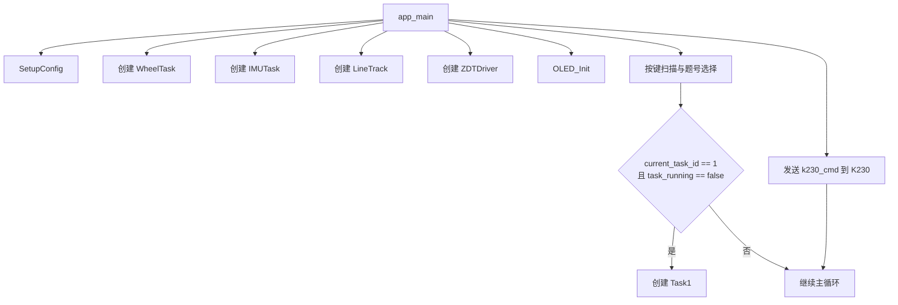
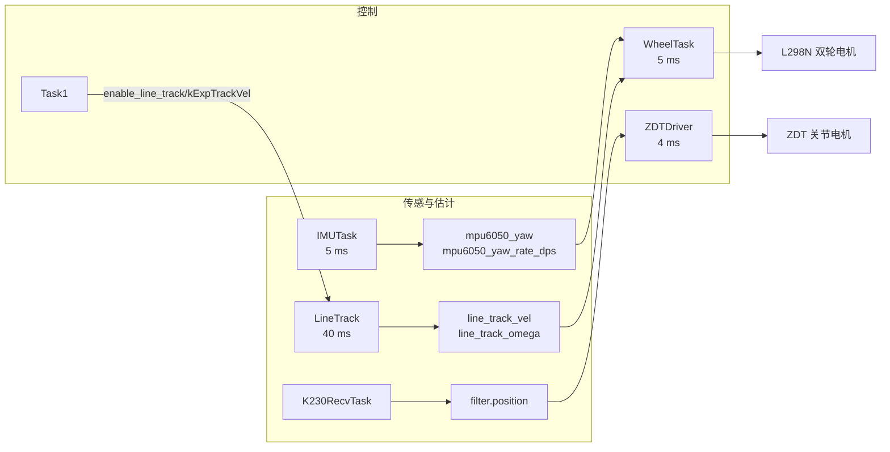
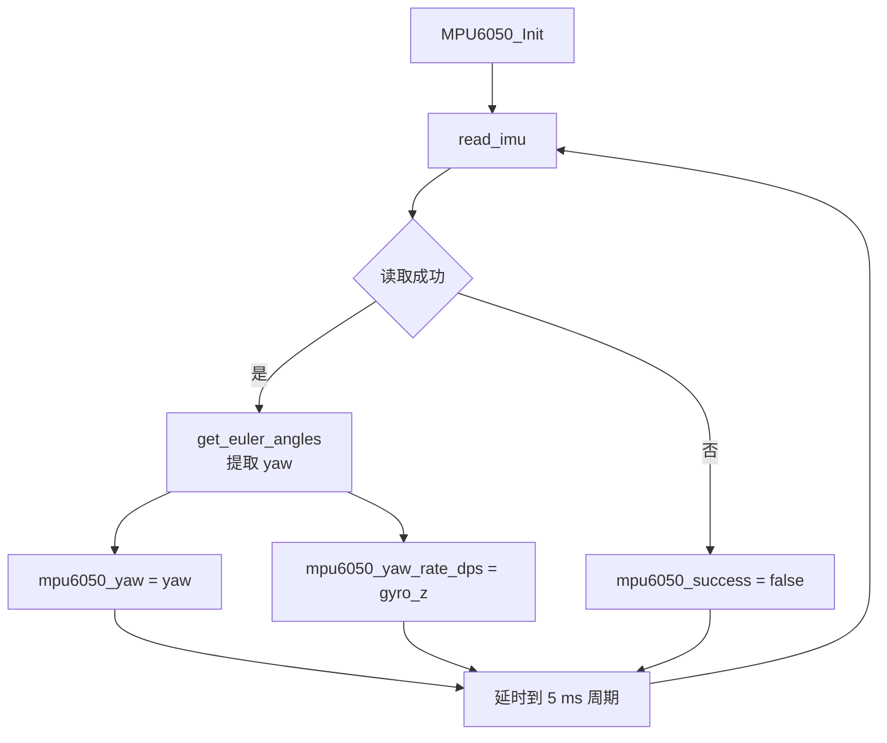
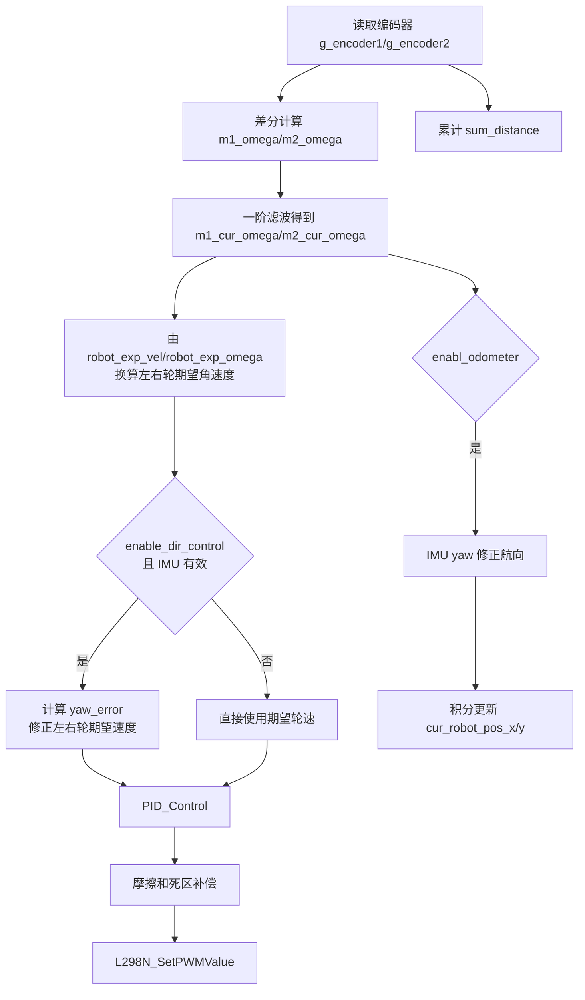
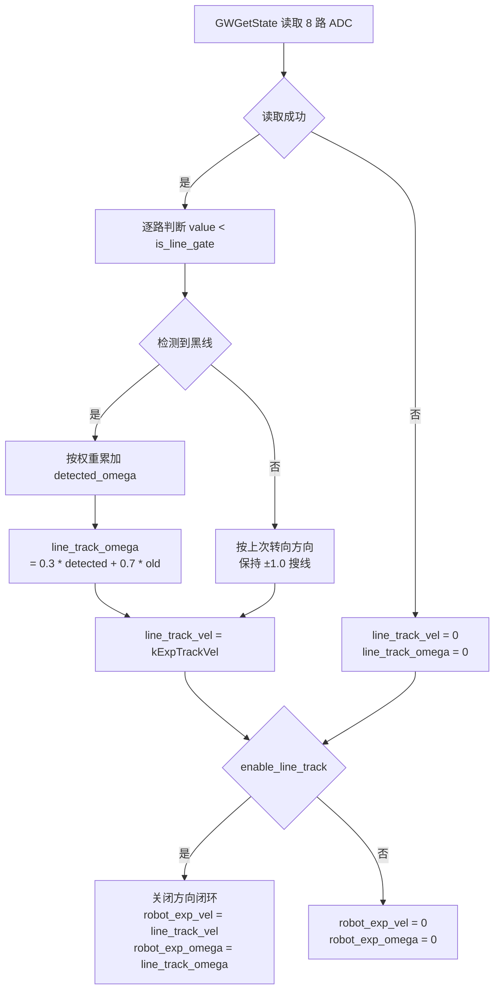
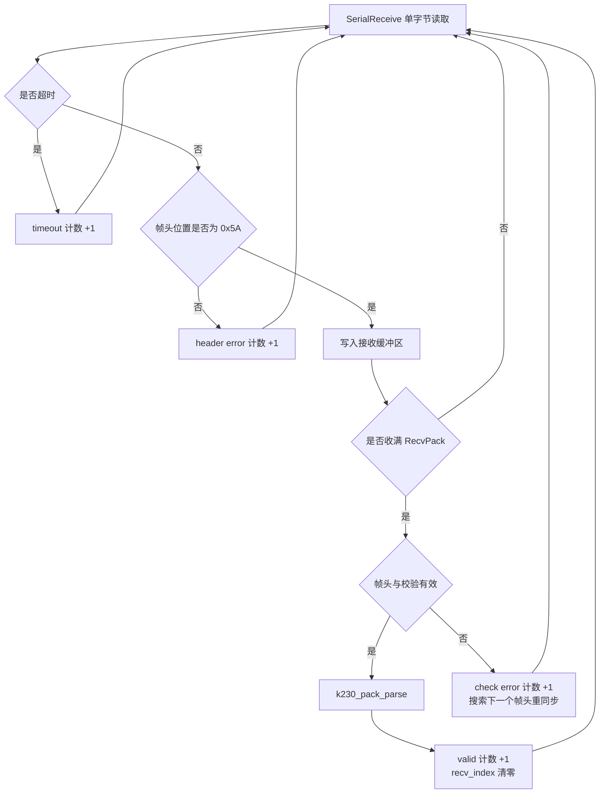
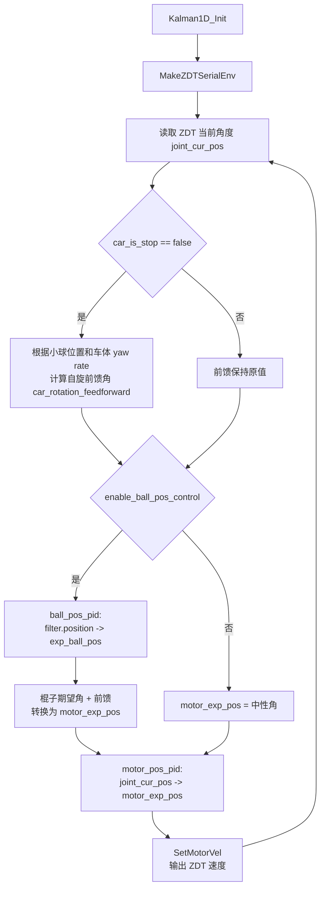
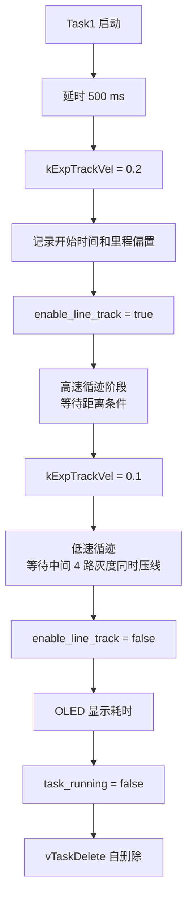
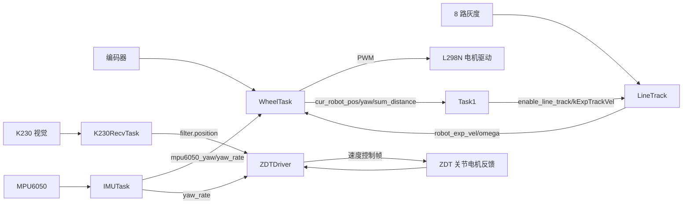

# APP 算法逻辑与数据处理流程

本文档基于 `APP/app_main.c` 和 `APP/mytask.c` 整理，描述当前应用层的任务组织、主要算法逻辑和数据处理路径。

## 1. 总体结构

`app_main()` 是应用入口，完成系统配置、FreeRTOS 任务创建、OLED 初始化、按键选题和任务启动。`mytask.c` 承载具体控制算法，包括 IMU 读取、轮速闭环、里程计、灰度循迹、ZDT 电机控制、K230 通讯解析和赛题任务。



主循环每 50 ms 执行一次：

- K1：清零当前任务号 `current_task_id`。
- K2：确认所选任务，将 `current_select_task_id` 写入 `current_task_id`。
- 上、下、左、右、中键：分别选择任务 1 到任务 5。
- 当前仅实现 `current_task_id == 1` 时创建 `Task1`。
- 每轮将 `k230_cmd` 置 0 后通过 `g_serial` 发送给 K230。

## 2. FreeRTOS 任务分工




| 任务           | 周期     | 主要输入                                    | 主要输出                                                 | 功能                                 |
| -------------- | -------- | ------------------------------------------- | -------------------------------------------------------- | ------------------------------------ |
| `IMUTask`      | 5 ms     | MPU6050 四元数、陀螺仪                      | `mpu6050_yaw`、`mpu6050_yaw_rate_dps`、`mpu6050_success` | 姿态角和角速度更新                   |
| `WheelTask`    | 5 ms     | 编码器、IMU yaw、底盘速度指令               | L298N PWM、里程计、VOFA 数据                             | 轮速滤波、方向闭环、速度 PID、里程计 |
| `LineTrack`    | 40 ms    | 8 路灰度 ADC                                | `robot_exp_vel`、`robot_exp_omega`                       | 灰度阈值自适应、循迹角速度计算       |
| `ZDTDriver`    | 4 ms     | ZDT 当前位置、Kalman 小球位置、IMU yaw rate | ZDT 速度指令                                             | 小球位置闭环和关节位置闭环           |
| `K230RecvTask` | 阻塞接收 | K230 串口帧                                 | Kalman 观测更新                                          | 帧同步、校验、位置解析               |
| `Task1`        | 流程任务 | `sum_distance`、灰度状态                    | `enable_line_track`、OLED 结果                           | 第一题执行流程                       |

> 注：`K230RecvTask` 在 `mytask.c` 中实现并在头文件声明，但当前 `app_main.c` 未创建该任务。

## 3. IMU 数据处理

`IMUTask()` 初始化 MPU6050 后循环读取 IMU 数据。



关键数据：

- `mpu6050_yaw`：当前航向角，单位为度。
- `mpu6050_yaw_rate_dps`：Z 轴角速度，单位为 deg/s。
- `mpu6050_success`：IMU 数据是否有效。

## 4. 底盘轮速闭环与里程计

`WheelTask()` 是底盘控制核心。它根据编码器差分得到轮速，经过一阶低通滤波后，与期望轮速做 PID 控制，最后输出到 L298N。



轮速计算：

```text
wheel_omega = 编码器增量 / 编码器线数 * 2π / 减速比 / 采样周期
```

底盘运动学：

```text
m1_exp_omega =  robot_exp_vel / R + robot_exp_omega * body_radius / R
m2_exp_omega = -robot_exp_vel / R + robot_exp_omega * body_radius / R
```

里程计更新：

```text
linear_vel = (m1_cur_omega - m2_cur_omega) * R / 2
vx = linear_vel * cos(yaw)
vy = linear_vel * sin(yaw)
pos += v * dt
```

其中 `R = 0.033 m`，控制周期 `dt = 0.005 s`。

## 5. 灰度循迹数据处理

`LineTrack()` 使用 8 路灰度传感器识别黑线，并根据黑线落在阵列中的位置生成转向角速度。

初始化阶段：

1. 启动后延时 3 s。
2. 以 50 ms 周期采集 40 次环境光。
3. 根据 8 路 ADC 的最小值和最大值计算阈值候选值。
4. 当亮暗差异足够大时，用一阶滤波更新 `is_line_gate`。

运行阶段：



8 路灰度权重从左到右为：

```c
{-1.2f, -0.7f, -0.3f, -0.1f, 0.1f, 0.3f, 0.7f, 1.2f}
```

因此左侧传感器压线时输出负角速度，右侧传感器压线时输出正角速度。实际转向方向还取决于底盘电机安装方向和运动学符号定义。

## 6. K230 通讯与小球位置滤波

K230 接收帧格式由 `RecvPack` 定义：

```c
typedef struct {
    uint8_t head;     // 0x5A
    float position;
    uint8_t check;    // 和校验
} RecvPack;
```

接收任务逻辑：



`k230_pack_parse()` 数据处理：

1. 将字节流复制为 `RecvPack`。
2. 使用 `PIXEL2POSITION(x)` 将视觉像素位置转换为物理位置。
3. 由当前关节角 `joint_cur_pos` 反解棍子角度 `stick_cur_angle`。
4. 用 `sin(stick_cur_angle) * 9.8` 估算小球沿杆方向加速度。
5. 根据两次视觉更新间隔计算 `dt`，并限制最大值。
6. 调用 `Kalman1D_Update(&filter, raw_position, raw_acc, dt)` 融合视觉位置和模型加速度。

## 7. ZDT 关节电机与钢球位置闭环

`ZDTDriver()` 负责读取 ZDT 关节电机当前位置，并根据小球位置控制需求输出电机速度。



两级控制关系：

- 外环：小球位置环
  `filter.position` 与 `exp_ball_pos` 做 PID，输出期望棍子角度。
- 内环：关节位置环
  `joint_cur_pos` 与 `motor_exp_pos` 做 PID，输出期望电机速度补偿。
- 前馈：当车体旋转时，根据向心加速度估算棍子补偿角。

机构角度换算：

- `stick_angle_to_motor_angle()`：由棍子角度计算电机角度。
- `motor_angle_to_stick_angle()`：由电机角度反解棍子角度。

## 8. Task1 赛题流程

`Task1()` 是当前唯一由 `app_main()` 自动创建的赛题任务。



任务意图可以概括为：

1. 启动循迹。
2. 先用较高速度接近终点区域。
3. 再降速，直到灰度阵列中间 4 路同时检测到黑线，认为到达停止线。
4. 停止循迹并显示耗时。

## 9. 关键全局数据流


