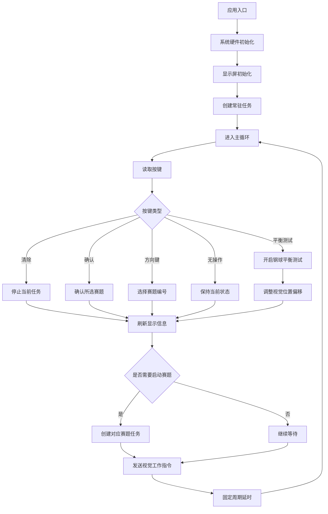
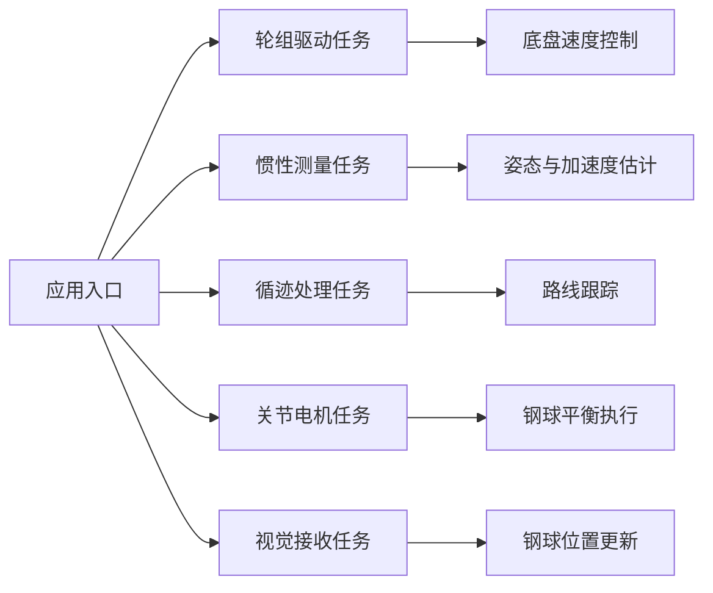
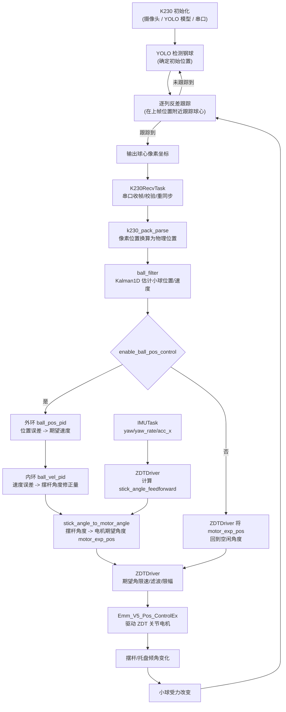
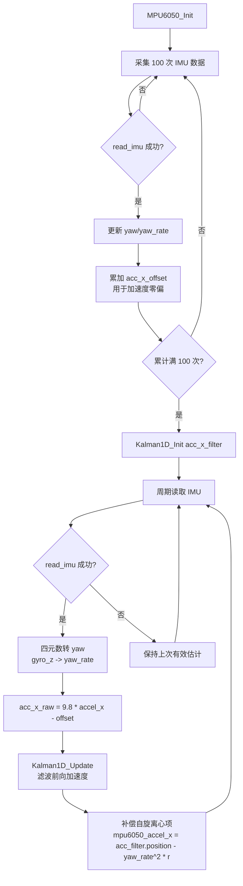
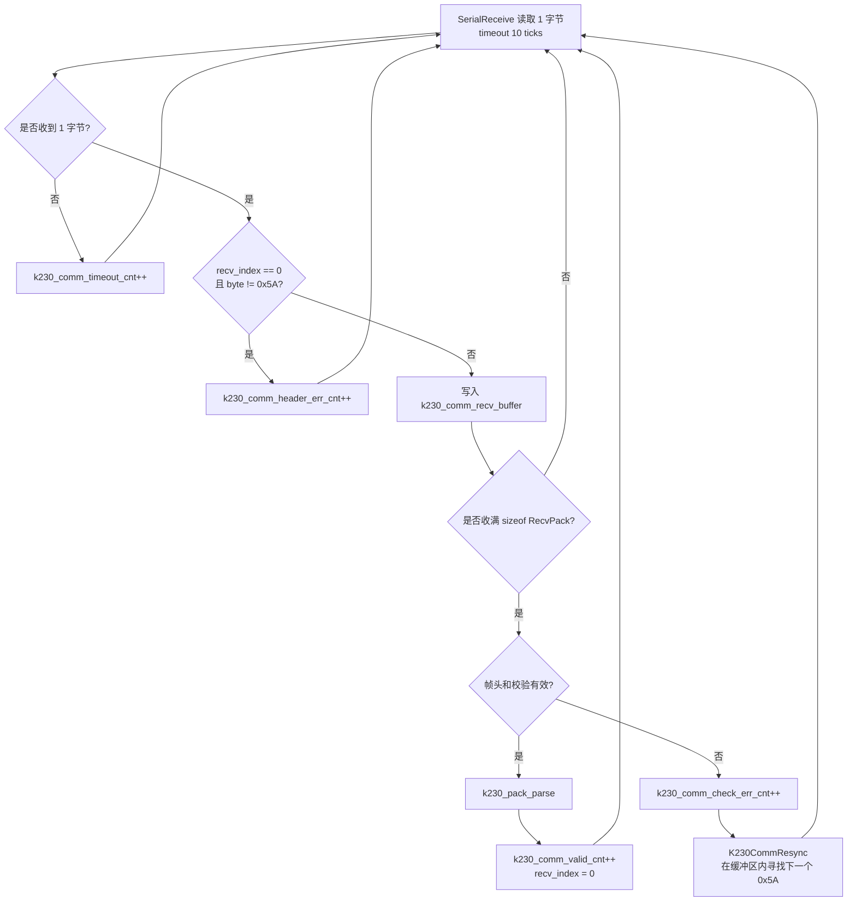
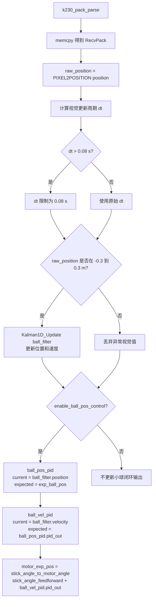
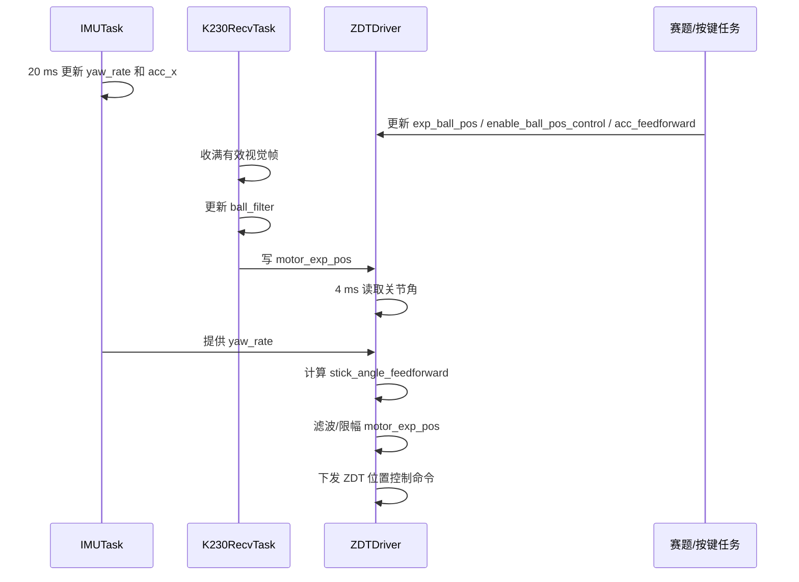
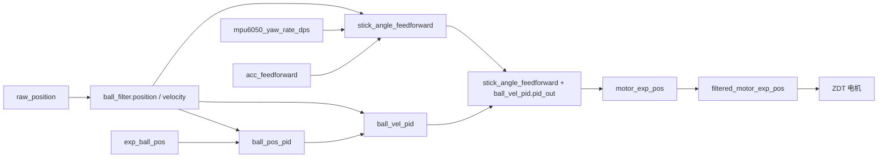

# 小球平衡控制算法流程

本文档基于 `APP/app_main.c` 和 `APP/mytask.c` 整理，描述项目从应用入口启动后的整体流程，以及小球平衡控制的数据流、闭环结构和任务时序。

## 1. 项目整体流程

`app_main()` 是应用层入口，负责完成系统初始化、创建常驻控制任务、处理按键交互、启动赛题任务，并周期性向视觉模块发送当前工作指令。



常驻任务创建后并行运行：



整体执行关系：

- 启动阶段先完成硬件与显示初始化，再创建轮组、惯性测量、循迹、关节电机、视觉接收等常驻任务。
- 主循环负责用户交互和赛题调度，不直接执行复杂控制算法。
- 赛题任务启动后，会按对应流程打开视觉识别、钢球平衡、路线跟踪或运动轨迹。
- 视觉接收、惯性测量和关节电机任务共同构成钢球平衡的实时闭环。

## 2. 小球平衡总体闭环

小球平衡控制由视觉位置闭环、关节电机执行闭环和 IMU 前馈补偿共同组成。



核心思路：

- K230 先用 YOLO 确定钢球初始位置，后续优先在上帧位置附近做逐列反差跟踪；跟踪失败时回到 YOLO 检测。
- `K230RecvTask` 接收 K230 输出的球心像素坐标，并转换为 `ball_filter.position` 和 `ball_filter.velocity`。
- `k230_pack_parse()` 在视觉数据到来时执行小球位置双环 PID，更新 `motor_exp_pos`。
- `ZDTDriver` 以 4 ms 周期读取关节角，并把 `motor_exp_pos` 平滑后下发给 ZDT 电机。
- `IMUTask` 提供 `mpu6050_yaw_rate_dps` 和 `mpu6050_accel_x`，用于自旋和加速度前馈补偿。

## 3. 任务职责

| 任务 | 周期/触发 | 主要输入 | 主要输出 | 在小球平衡中的作用 |
| --- | --- | --- | --- | --- |
| `IMUTask` | 初始化阶段 5 ms，运行阶段 20 ms | MPU6050 四元数、陀螺仪、加速度 | `mpu6050_yaw`、`mpu6050_yaw_rate_dps`、`mpu6050_accel_x`、`mpu6050_success` | 提供自旋角速度和前向加速度补偿量 |
| `K230RecvTask` | 串口阻塞单字节接收 | K230 `RecvPack` 帧 | `raw_position`、`ball_filter`、`motor_exp_pos` | 解析视觉位置并执行小球位置/速度双闭环 |
| `ZDTDriver` | 4 ms | `motor_exp_pos`、`ball_filter.position`、IMU yaw rate、ZDT 当前角 | `filtered_motor_exp_pos`、ZDT 位置控制命令 | 执行关节电机控制，并叠加前馈与输出保护 |

## 4. IMUTask：姿态与加速度估计



关键公式：

```text
acc_x_raw = 9.8 * mpu6050_accel_sample_g[0] - acc_x_offset
mpu6050_accel_x = acc_x_filter.position
                 - mpu6050_yaw_rate_dps^2 * DEG_TO_RAD^2 * 0.14
```

`mpu6050_accel_x` 后续可与轨迹期望加速度融合，形成 `acc_feedforward`。`mpu6050_yaw_rate_dps` 会被 `ZDTDriver` 用于小球自旋补偿。

## 5. K230RecvTask：视觉接收与小球双环 PID

K230 接收帧格式：

```c
typedef struct {
    uint8_t head;     // 0x5A
    float position;  // 视觉位置
    uint8_t check;   // 和校验
} RecvPack;
```

串口收帧流程：



位置解析与控制流程：



控制结构为串级 PID：

```text
位置外环：exp_ball_pos - ball_filter.position -> ball_pos_pid.pid_out
速度内环：ball_pos_pid.pid_out - ball_filter.velocity -> ball_vel_pid.pid_out
摆杆期望角：stick_angle_feedforward + ball_vel_pid.pid_out
电机期望角：stick_angle_to_motor_angle(摆杆期望角)
```

当前参数：

```c
PID ball_pos_pid = {.Kp = 2.5f, .Kd = 0.0f, .Ki = 0.0f,
                    .limit = 5.0f, .output_limit = 0.09f};
PID ball_vel_pid = {.Kp = 30.0f, .Kd = 0.0f, .Ki = 1.0f,
                    .limit = 10.0f, .output_limit = 6.0f};
```

## 6. ZDTDriver：关节电机执行与前馈补偿

```mermaid
flowchart TD
    A[Kalman1D_Init ball_filter] --> B[MakeZDTSerialEnv]
    B --> C[filtered_motor_exp_pos 初始化为空闲角]
    C --> D[4 ms 周期循环]
    D --> E[读取 ZDT 当前角度<br/>joint_cur_pos = -angle_temp]
    E --> F{car_is_stop == false?}
    F -- 是 --> G[根据球位置和 yaw_rate 计算自旋/加速度前馈]
    G --> H[forward_acc = BALL_POS_TO_CENTER_DIS(position) * yaw_rate^2 - acc_feedforward]
    H --> I[gravity_ratio = clamp(forward_acc / 9.8, -1, 1)]
    I --> J[stick_angle_feedforward = asin(gravity_ratio)]
    F -- 否 --> K[保持当前前馈]
    J --> L{enable_ball_pos_control?}
    K --> L
    L -- 否 --> M[motor_exp_pos = 空闲角]
    L -- 是 --> N[使用 K230RecvTask 更新的 motor_exp_pos]
    M --> O[limit_motor_exp_pos_step<br/>限制期望角单步变化]
    N --> O
    O --> P[一阶滤波<br/>filtered = 0.6 old + 0.4 limited]
    P --> Q[安全限幅 0 到 50 deg]
    Q --> R[Emm_V5_Pos_ControlEx<br/>目标=-filtered_motor_exp_pos<br/>反馈=-joint_cur_pos]
    R --> D
```

前馈用于抵消加速运动和平台自旋对小球的等效加速度：

```text
yaw_rate_rad_s = mpu6050_yaw_rate_dps * DEG_TO_RAD
forward_acc = BALL_POS_TO_CENTER_DIS(ball_filter.position) * yaw_rate_rad_s^2
              - acc_feedforward
stick_angle_feedforward = asin(clamp(forward_acc / 9.8, -1, 1))
```

输出保护包括三层：

- `limit_motor_exp_pos_step()`：限制 `motor_exp_pos` 到 `filtered_motor_exp_pos` 的单周期变化，默认 `max_motor_exp_step = 1.0f`。
- `ball_pid_output_filter_gate = 0.6f`：对电机期望角做一阶低通。
- `filtered_motor_exp_pos` 限制在 `0.0f` 到 `50.0f`，避免异常数据损坏电机。

## 7. 控制时序



需要注意的是，小球双环 PID 在 `K230RecvTask` 收到有效视觉帧时更新，不是固定 4 ms 更新；`ZDTDriver` 则以固定 4 ms 周期不断执行最近一次得到的 `motor_exp_pos`。

## 8. 关键变量关系



| 变量 | 来源 | 含义 |
| --- | --- | --- |
| `raw_position` | `K230RecvTask` | K230 原始位置换算后的物理位置，单位 m |
| `ball_filter.position` | `Kalman1D_Update` | 小球滤波位置 |
| `ball_filter.velocity` | `Kalman1D_Update` | 小球滤波速度 |
| `exp_ball_pos` | 赛题任务/测试按键 | 小球目标位置 |
| `stick_angle_feedforward` | `ZDTDriver` | 自旋和运动加速度对应的摆杆前馈角 |
| `motor_exp_pos` | `k230_pack_parse` 或 `ZDTDriver` | ZDT 电机目标角度 |
| `filtered_motor_exp_pos` | `ZDTDriver` | 限速、滤波、限幅后的电机目标角 |
| `mpu6050_accel_x` | `IMUTask` | 补偿自旋后的前向加速度估计 |
| `acc_feedforward` | 赛题任务 | 轨迹运动加速度前馈 |

## 9. 平衡控制链路小结

当前算法可概括为：

```text
视觉测球位置
-> Kalman 估计球位置/速度
-> 位置 PID 生成球期望速度
-> 速度 PID 生成摆杆角修正量
-> IMU/运动加速度生成摆杆前馈角
-> 摆杆角映射为 ZDT 电机角
-> 限速、低通、限幅
-> ZDT 关节电机改变托盘倾角
-> 小球位置变化后再次被视觉测量
```

其中 `IMUTask` 负责估计运动引起的惯性补偿量，`K230RecvTask` 负责视觉闭环更新，`ZDTDriver` 负责将闭环结果稳定地下发到关节电机。
