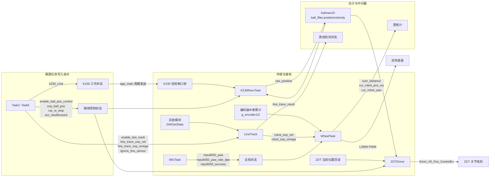
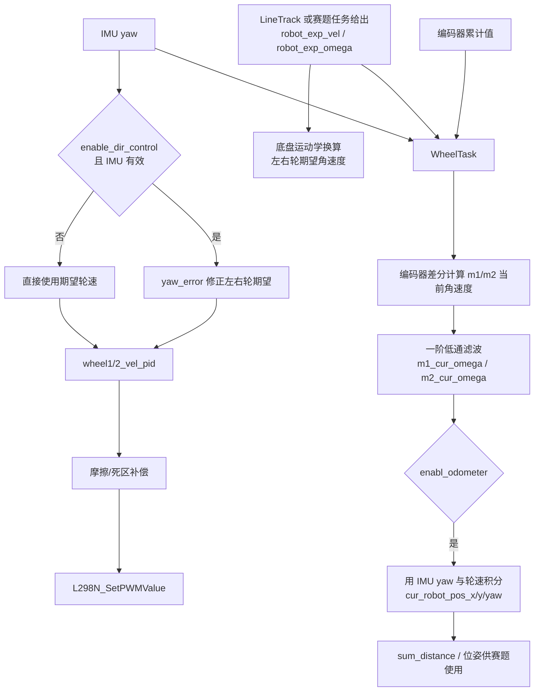
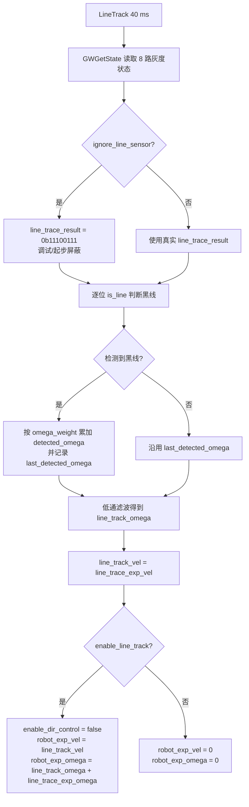
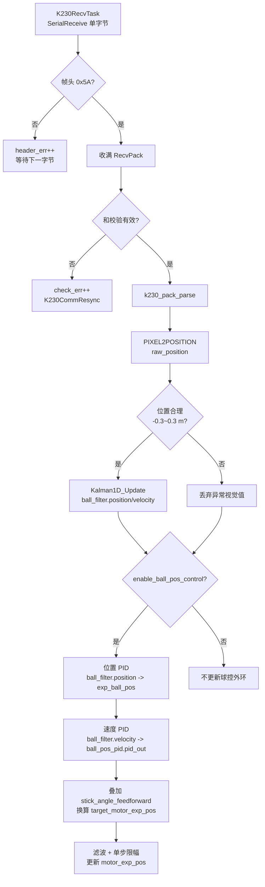
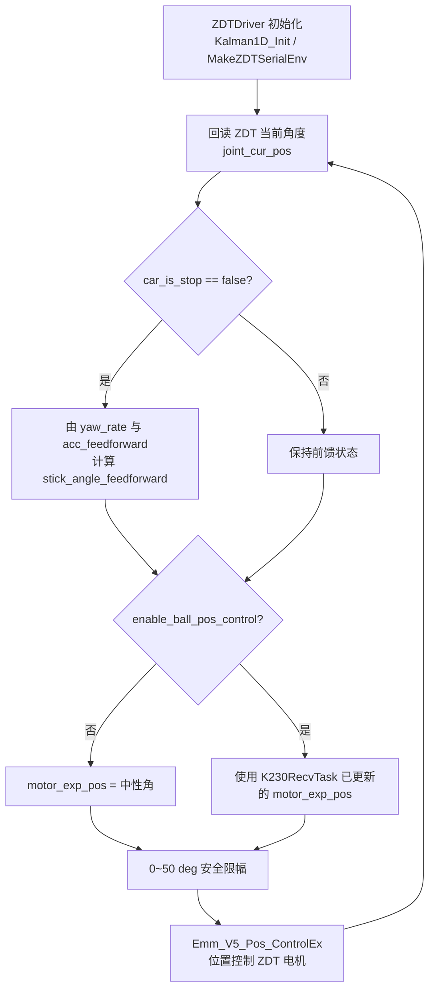
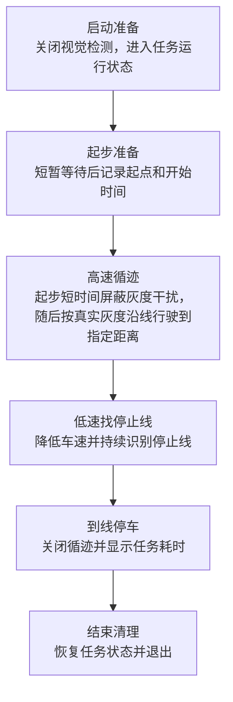
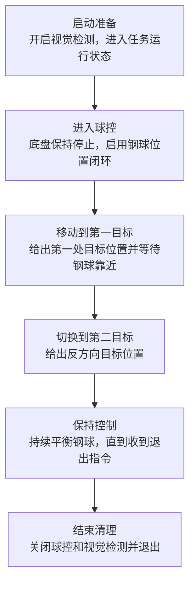
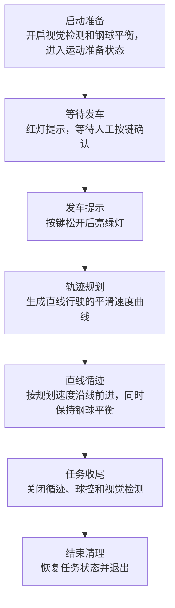
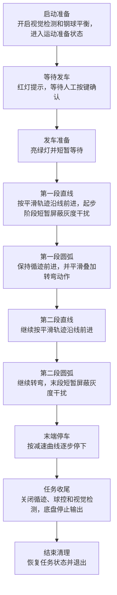
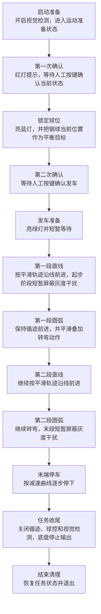

# APP 程序整体流程与数据流向

本文档根据当前 `APP/app_main.c` 与 `APP/mytask.c` 整理，描述应用层整体调度、后台控制任务、Task1~Task5 赛题流程，以及关键数据在各任务之间的流向。`docs/algorithm_flow.md` 为旧版本参考，本文以当前代码为准。

## 1. 整体程序流程

`app_main()` 完成硬件与任务初始化，然后进入 50 ms UI 主循环。后台任务常驻运行；赛题任务由按键选择并确认后按需创建，同一时刻只允许一个赛题任务运行。

```mermaid
flowchart TD
    A[app_main] --> B[SetupConfig<br/>电机/编码器/串口/中断初始化]
    B --> C[OLED_Init]
    C --> D[创建常驻 FreeRTOS 任务]
    D --> D1[WheelTask<br/>5 ms]
    D --> D2[IMUTask<br/>5 ms]
    D --> D3[LineTrack<br/>40 ms]
    D --> D4[ZDTDriver<br/>4 ms]
    D --> D5[K230RecvTask<br/>串口阻塞接收]
    D --> E[UI 主循环<br/>每 50 ms]

    E --> F{按键扫描}
    F -->|K1 清零| G[current_task_id = 0<br/>force_exit = true]
    F -->|K2 确认| H[current_task_id = current_select_task_id]
    F -->|UP/DOWN/LEFT/RIGHT/MAIN| I[选择 Task1~Task5]
    F -->|K3| J[球平衡测试模式<br/>enable_ball_pos_control = true]

    H --> K{task_running == false?}
    I --> E
    J --> E
    G --> E
    K -->|Task1| T1[xTaskCreate Task1]
    K -->|Task2| T2[xTaskCreate Task2]
    K -->|Task3| T3[xTaskCreate Task3]
    K -->|Task4| T4[xTaskCreate Task4]
    K -->|Task5| T5[xTaskCreate Task5]
    K -->|无任务/任务运行中| L[继续刷新 OLED]
    T1 --> L
    T2 --> L
    T3 --> L
    T4 --> L
    T5 --> L
    L --> M[SerialTransmit(g_serial, k230_cmd)<br/>向 K230 更新视觉工作状态]
    M --> E
```

### 按键与全局状态

| 按键 | 当前作用 | 主要影响 |
| --- | --- | --- |
| `KEY3_K1` | 任务清零/强制退出 | `current_task_id = 0`，`force_exit = true` |
| `KEY3_K2` | 确认选题 | `current_task_id = current_select_task_id` |
| `KEY3_K3` | 球平衡测试或赛题内启动确认 | 主循环中进入 `ball_test`；Task3/4/5 中作为启动确认键 |
| `KEY5_UP` | 选择 Task1 | `current_select_task_id = 1` |
| `KEY5_DOWN` | 选择 Task2 | `current_select_task_id = 2` |
| `KEY5_LEFT` | 选择 Task3 | `current_select_task_id = 3` |
| `KEY5_RIGHT` | 选择 Task4 | `current_select_task_id = 4` |
| `KEY5_MAIN` | 选择 Task5 | `current_select_task_id = 5` |

## 2. 常驻任务分工



| 任务 | 周期/触发 | 输入 | 输出 | 作用 |
| --- | --- | --- | --- | --- |
| `IMUTask` | 5 ms | MPU6050 四元数、陀螺仪 | `mpu6050_yaw`、`mpu6050_yaw_rate_dps`、`mpu6050_success` | 姿态读取与 yaw 更新 |
| `WheelTask` | 5 ms | 编码器、IMU yaw、`robot_exp_vel/omega` | 电机 PWM、`sum_distance`、`cur_robot_pos_x/y/yaw` | 轮速闭环、方向闭环、里程计 |
| `LineTrack` | 40 ms | 灰度状态、循迹期望速度/附加角速度 | `robot_exp_vel`、`robot_exp_omega`、`line_trace_result` | 灰度循迹和底盘速度指令生成 |
| `ZDTDriver` | 4 ms | ZDT 位置、钢球控制目标、IMU yaw rate | `motor_exp_pos` 位置控制命令 | 关节电机位置控制与前馈计算 |
| `K230RecvTask` | 串口阻塞接收 | K230 `RecvPack` | `ball_filter`、`raw_position`、`motor_exp_pos` | 视觉帧解析、钢球卡尔曼滤波、球控外环 |

## 3. 底盘控制链路



## 4. 循迹数据处理



当前灰度转向权重为：

```c
{-1.5f, -0.9f, -0.3f, -0.1f, 0.1f, 0.3f, 0.9f, 1.5f}
```

## 5. K230 视觉与钢球控制数据流



`ZDTDriver` 每 4 ms 回读关节角度并执行电机位置命令：



## 6. Task1 流程图

Task1 为基础循迹到停止线流程，不启用 K230 视觉和钢球位置控制。



## 7. Task2 流程图

Task2 为钢球位置控制流程，底盘不循迹，等待强制退出。



## 8. Task3 流程图

Task3 为直线循迹运动加钢球平衡控制，使用五次多项式规划距离-速度-加速度。



## 9. Task4 流程图

Task4 为带钢球平衡的路径任务：直线、圆弧、直线、圆弧、末端减速停止。



## 10. Task5 流程图

Task5 的路径执行部分与 Task4 基本一致；不同点是启动阶段先等待人工确认当前钢球位置，并将钢球平衡目标锁定在当前位置。



## 11. 关键全局数据流向

| 数据/状态 | 写入者 | 读取者 | 含义 |
| --- | --- | --- | --- |
| `current_select_task_id` | `app_main` 按键扫描 | `app_main` 确认逻辑 | 当前 UI 选中的赛题编号 |
| `current_task_id` | `app_main`、赛题任务清理 | `app_main` 任务创建逻辑 | 当前待启动/正在执行的赛题编号 |
| `task_running` | `app_main`、Task1~5 | `app_main` | 防止重复创建赛题任务 |
| `force_exit` | `app_main` K1、Task1~5 | Task2~5 | 强制退出任务流程 |
| `k230_cmd` | `app_main`、Task1~5、测试逻辑 | `app_main` 串口发送、K230 外设 | 通知 K230 是否进入视觉检测状态 |
| `mpu6050_yaw` | `IMUTask` | `WheelTask`、OLED | 当前航向角 |
| `mpu6050_yaw_rate_dps` | `IMUTask` | `ZDTDriver` | 车体旋转前馈计算 |
| `g_encoder1/2.encoder_value` | 编码器中断 | `WheelTask` | 轮编码器累计值 |
| `sum_distance` | `WheelTask` | Task1/3/4/5、OLED | 底盘累计行驶距离 |
| `cur_robot_pos_x/y/yaw` | `WheelTask` | OLED/调试 | 里程计位姿 |
| `line_trace_result` | `LineTrack` | Task1 | 8 路灰度当前状态 |
| `line_trace_exp_vel` | Task1/3/4/5 | `LineTrack` | 循迹目标线速度 |
| `line_trace_exp_omega` | Task4/5 | `LineTrack` | 圆弧段叠加角速度 |
| `enable_line_track` | Task1/3/4/5、Task2 | `LineTrack` | 是否把循迹结果输出到底盘 |
| `ignore_line_sensor` | Task1/3/4/5 | `LineTrack` | 是否临时屏蔽真实灰度输入 |
| `robot_exp_vel/omega` | `LineTrack` | `WheelTask` | 底盘最终速度指令 |
| `raw_position` | `K230RecvTask` | VOFA/调试 | 视觉位置物理量 |
| `ball_filter.position/velocity` | `K230RecvTask` | Task2/5、ZDT/球控逻辑 | 钢球位置与速度估计 |
| `exp_ball_pos` | Task2/3/4/5 | `K230RecvTask` 球控外环 | 钢球期望位置 |
| `enable_ball_pos_control` | `app_main`、Task2~5 | `K230RecvTask`、`ZDTDriver` | 是否启用钢球位置闭环 |
| `car_is_stop` | Task3/4/5、清理逻辑 | `ZDTDriver` | 是否计算车体运动前馈 |
| `acc_feedforward` | Task3/4/5 | `ZDTDriver` | 直线加减速前馈 |
| `stick_angle_feedforward` | `ZDTDriver` | `K230RecvTask` | 钢球控制目标中的机构角度前馈 |
| `motor_exp_pos` | `K230RecvTask`、`ZDTDriver` | `ZDTDriver` | ZDT 电机目标位置 |

## 12. Task1~5 对主要控制开关的使用

| 任务 | `k230_cmd` | `enable_line_track` | `enable_ball_pos_control` | `car_is_stop` | 退出方式 |
| --- | --- | --- | --- | --- | --- |
| Task1 | 0 | 开启后循迹，到停止线关闭 | 不启用 | 默认保持 | 到停止线后自动退出 |
| Task2 | 1 | 关闭 | 开启 | 默认保持 | 等待 `force_exit` |
| Task3 | 1 | 五次轨迹直线段开启 | 开启 | `false` | 轨迹完成或 `force_exit` |
| Task4 | 1 | 五段路径期间开启 | 开启 | `false`，结束置 `true` | 路径完成或 `force_exit` |
| Task5 | 1 | 五段路径期间开启 | 先锁定当前球位后开启 | `false`，结束置 `true` | 路径完成或 `force_exit` |
